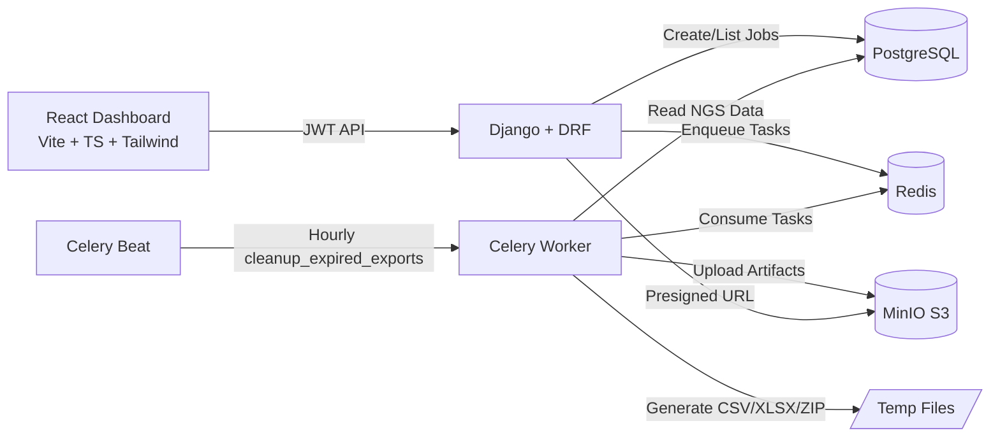

# LabExportHub (NGS Exports)

Portfolio project for **NGS pipeline exports** with Django + DRF + Celery + Redis + Postgres + MinIO, plus a React dashboard for operations and demo recording.

## Architecture


## Tech Stack
- Backend: Django, DRF, drf-spectacular, Celery
- Data: PostgreSQL, Redis
- Storage: MinIO (S3-compatible)
- Frontend: React + TypeScript + Vite + Tailwind + shadcn/ui

## Quick Start
```bash
cp .env.example .env
make up
make migrate
```

Open:
- API: `http://localhost:8000/api/`
- Swagger: `http://localhost:8000/api/docs/`
- MinIO Console: `http://localhost:9001`

## Frontend
```bash
cd frontend
npm install
npm run dev
```

Open:
- Dashboard: `http://localhost:5173`
- Demo Recorder: `http://localhost:5173/demo`
- NGS Samples CRUD: `http://localhost:5173/samples`
- Pipeline Reports: `http://localhost:5173/exports`

## One-Command Demo (Recommended for Screen Recording)
Run this once before recording:
```bash
make demo
```

What it does:
1. Starts containers
2. Applies migrations
3. Creates demo admin user (`demo` / `demo1234`)
4. Seeds NGS sample records
5. Queues two export jobs (trimming and full pipeline)

After that:
```bash
cd frontend
npm install
npm run dev
```
Then open `http://localhost:5173/demo` and click **Run Full Demo**.

## Screen Recording Flow (2-3 min)
1. Show architecture diagram in this README.
2. Open `/samples` and show CRUD over genomic records.
3. Open `/demo` and run full flow.
4. Navigate to `/dashboard` (NGS KPIs + trends).
5. Open `/exports` (pipeline reports list and download actions).
6. Open one `/exports/:id` detail view with generated content preview + events.

## Authentication
JWT endpoints:
- `POST /api/auth/token/`
- `POST /api/auth/token/refresh/`
- `GET /api/me/`

## NGS Endpoints
- `GET/POST /api/ngs/sequences/`
- `GET/POST /api/exports/`
- `GET /api/exports/{id}/`
- `GET /api/exports/{id}/events/`
- `POST /api/exports/{id}/presign/`

## Example API Calls
Get JWT token:
```bash
curl -X POST http://localhost:8000/api/auth/token/ \
  -H "Content-Type: application/json" \
  -d '{"username":"demo","password":"demo1234"}'
```

Create NGS sequence:
```bash
curl -X POST http://localhost:8000/api/ngs/sequences/ \
  -H "Authorization: Bearer <ACCESS_TOKEN>" \
  -H "Content-Type: application/json" \
  -d '{
    "sample_id":"SAMPLE-001",
    "sequence":"ACGTACGTACGT",
    "platform":"ILLUMINA",
    "raw_reads":1500000,
    "trimmed_reads":1300000,
    "aligned_reads":1180000,
    "read_length":150,
    "q30_rate_percent":91.7,
    "mean_depth":84.2,
    "variant_count":112,
    "pipeline_status":"SUCCEEDED"
  }'
```

Create trimming export:
```bash
curl -X POST http://localhost:8000/api/exports/ \
  -H "Authorization: Bearer <ACCESS_TOKEN>" \
  -H "Content-Type: application/json" \
  -d '{"kind":"NGS_TRIMMING_REPORT","format":"csv","params":{"days":30}}'
```

Create full pipeline export:
```bash
curl -X POST http://localhost:8000/api/exports/ \
  -H "Authorization: Bearer <ACCESS_TOKEN>" \
  -H "Content-Type: application/json" \
  -d '{"kind":"NGS_PIPELINE_REPORT","format":"zip","params":{"days":30}}'
```

Get presigned URL:
```bash
curl -X POST http://localhost:8000/api/exports/<JOB_ID>/presign/ \
  -H "Authorization: Bearer <ACCESS_TOKEN>"
```

## Useful Commands
```bash
make up
make down
make logs
make migrate
make seed
make test
make demo
```

## Screenshots (Placeholders)
- `docs/screenshots/demo-recorder.png`
- `docs/screenshots/dashboard.png`
- `docs/screenshots/exports-list.png`
- `docs/screenshots/export-detail.png`
- `docs/screenshots/minio-objects.png`
