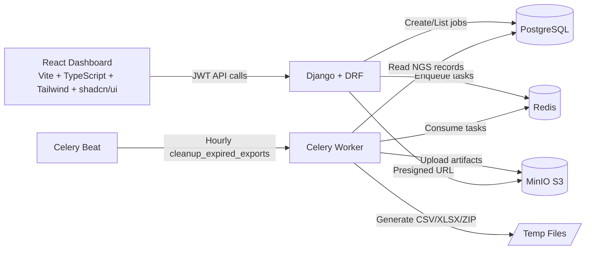

# LabExportHub

LabExportHub is a portfolio-grade NGS data platform that demonstrates a full async export workflow: authenticated users register sequencing samples, queue report generation jobs, process artifacts in Celery workers, store outputs in MinIO (S3-compatible), and retrieve results through presigned URLs from a React dashboard.

## What This Project Demonstrates
- End-to-end product flow for NGS reporting (API + worker + storage + UI).
- Clean separation between web requests and heavy file generation.
- Role-aware data access (`ADMIN` and `USER`) with JWT authentication.
- Production-style local setup with Docker Compose, Celery beat scheduling, and test coverage.

## Architecture


## Core Features
- JWT auth endpoints (`token`, `token/refresh`, `me`).
- Role-based authorization:
  - `USER` sees only own NGS samples and exports.
  - `ADMIN` sees all records.
- NGS sample CRUD with pipeline metrics (reads, Q30, depth, variants, status).
- Async export jobs with status lifecycle, progress counters, and event logs.
- Export formats:
  - `csv`
  - `xlsx` (Results sheet + formatted header)
  - `zip` (CSV + JSON summary)
- Secure download via presigned URLs.
- Hourly cleanup of expired artifacts (mark as `EXPIRED`, delete S3 object when possible).
- OpenAPI + Swagger docs for API exploration.
- Frontend pages for dashboard, samples CRUD, exports listing/detail, and demo recording flow.

## Tech Stack

### Backend
- Django 5.1
- Django REST Framework 3.15
- drf-spectacular (OpenAPI/Swagger)
- djangorestframework-simplejwt
- Celery 5.4
- boto3

### Data and Infra
- PostgreSQL 16
- Redis 7
- MinIO (S3-compatible)
- Docker Compose
- Makefile automation

### Frontend
- Vite + React 19 + TypeScript
- Tailwind CSS + shadcn/ui (Radix)
- TanStack Query
- TanStack Table
- React Router
- Recharts
- lucide-react

## Monorepo Structure
```text
backend/     Django apps, API, models, Celery tasks
frontend/    React dashboard (Vite + TS)
infra/       Docker build assets
docs/        Project docs and recording runbook
scripts/     Bootstrap/demo scripts
```

## Local Setup

### 1) Start backend stack
```bash
cp .env.example .env
make up
make migrate
```

Useful URLs:
- API root: `http://localhost:8000/api/`
- Swagger UI: `http://localhost:8000/api/docs/`
- OpenAPI schema: `http://localhost:8000/api/schema/`
- MinIO API: `http://localhost:9000`
- MinIO console: `http://localhost:9001`

### 2) Start frontend
```bash
cd frontend
npm install
npm run dev
```

Frontend URL:
- `http://localhost:5173`

Vite proxies `/api` to `http://127.0.0.1:8000` by default.

## One-Command Demo (Best for Screencast)
```bash
make demo
```

This command:
1. Starts containers.
2. Applies migrations.
3. Creates demo admin user.
4. Seeds NGS sample records.
5. Queues sample NGS exports.

Demo credentials:
- Username: `demo`
- Password: `demo1234`

Then run frontend and open:
- `http://localhost:5173/demo`

## Authentication Flow

Get token pair:
```bash
curl -X POST http://localhost:8000/api/auth/token/ \
  -H "Content-Type: application/json" \
  -d '{"username":"demo","password":"demo1234"}'
```

Refresh access token:
```bash
curl -X POST http://localhost:8000/api/auth/token/refresh/ \
  -H "Content-Type: application/json" \
  -d '{"refresh":"<REFRESH_TOKEN>"}'
```

Get current user:
```bash
curl http://localhost:8000/api/me/ \
  -H "Authorization: Bearer <ACCESS_TOKEN>"
```

## API Endpoints (Main)

### Auth
- `POST /api/auth/token/`
- `POST /api/auth/token/refresh/`
- `GET /api/me/`

### NGS
- `GET /api/ngs/sequences/`
- `POST /api/ngs/sequences/`
- `GET /api/ngs/sequences/{id}/`
- `PATCH /api/ngs/sequences/{id}/`
- `DELETE /api/ngs/sequences/{id}/`

### Exports
- `GET /api/exports/`
- `POST /api/exports/`
- `GET /api/exports/{id}/`
- `GET /api/exports/{id}/events/`
- `POST /api/exports/{id}/presign/`

## Export Examples

Create trimming report:
```bash
curl -X POST http://localhost:8000/api/exports/ \
  -H "Authorization: Bearer <ACCESS_TOKEN>" \
  -H "Content-Type: application/json" \
  -d '{"kind":"NGS_TRIMMING_REPORT","format":"csv","params":{"days":30}}'
```

Create full pipeline report:
```bash
curl -X POST http://localhost:8000/api/exports/ \
  -H "Authorization: Bearer <ACCESS_TOKEN>" \
  -H "Content-Type: application/json" \
  -d '{"kind":"NGS_PIPELINE_REPORT","format":"zip","params":{"days":30}}'
```

Get presigned URL (READY jobs only):
```bash
curl -X POST http://localhost:8000/api/exports/<JOB_ID>/presign/ \
  -H "Authorization: Bearer <ACCESS_TOKEN>"
```

## Frontend Pages
- `/dashboard`: NGS KPIs, trend chart, recent jobs.
- `/samples`: NGS sample CRUD.
- `/exports`: export table, filtering, presign action.
- `/exports/:id`: job details, metrics, events, preview/download.
- `/demo`: guided flow for live presentation/recording.

## Development Commands
```bash
make up        # start services
make down      # stop services
make logs      # follow logs
make migrate   # run migrations
make seed      # seed lab dataset fixtures
make test      # run backend tests
make format    # format code in web container
make lint      # lint/check code in web container
make demo      # full demo bootstrap
```

## Testing and Validation
```bash
# backend tests
make test

# optional checks
docker compose exec web python manage.py check
docker compose exec web python manage.py spectacular --file /tmp/openapi.yaml --validate
```

## Troubleshooting

### "Authentication credentials were not provided"
- Generate a JWT via `/api/auth/token/`.
- Set `Authorization: Bearer <ACCESS_TOKEN>` in API calls.

### "Given token not valid for any token type"
- Access token expired or malformed.
- Request a new access token using `/api/auth/token/refresh/`.
- In frontend, clear stored token and authenticate again.

### Vite proxy errors (`ECONNRESET`, `socket hang up`)
- Ensure backend is up: `make up`.
- Check logs: `make logs` or `docker compose logs web worker`.
- Confirm API health at `http://localhost:8000/api/`.

### Presigned link opens wrong host (e.g. minio internal hostname)
- Keep `.env` with:
  - `S3_ENDPOINT_URL=http://minio:9000`
  - `S3_PRESIGN_ENDPOINT_URL=http://localhost:9000`
- Restart services after env changes: `make down && make up`.

## Screenshots (Placeholders)
- `docs/screenshots/demo-recorder.png`
- `docs/screenshots/dashboard.png`
- `docs/screenshots/samples-crud.png`
- `docs/screenshots/exports-list.png`
- `docs/screenshots/export-detail.png`
- `docs/screenshots/minio-objects.png`

## Notes for Portfolio Reviewers
This project intentionally focuses on operational reliability patterns common in production export systems: async processing, resumable job state, storage decoupling, role-based access controls, and documentation-first API workflows.
